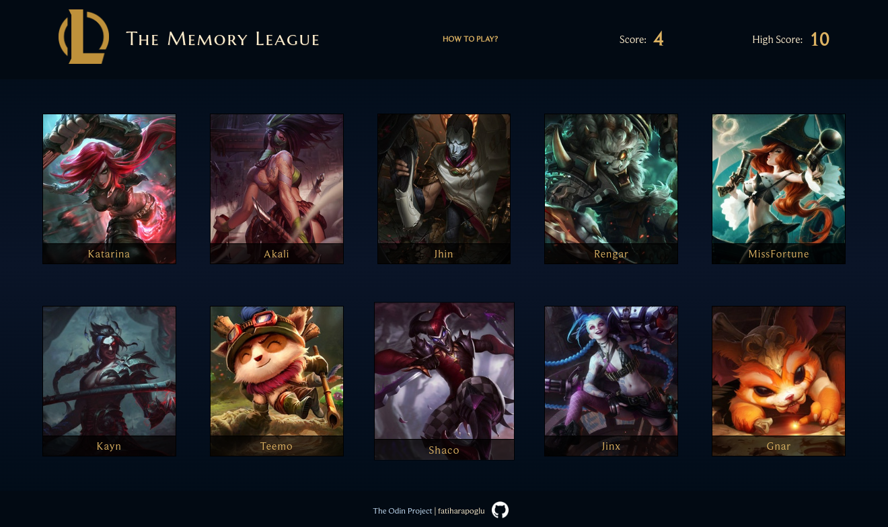

# The Memory League

A React memory game of [League of Legends](https://leagueoflegends.com/). The goal of the game is to avoid clicking the same champion twice.

Created with **React**.

⮕ [Live preview](https://fatiharapoglu.github.io/memory-lol/)

## Features

-   At least one new image after re-render, for player to not fail unfairly.
-   30 different champions, therefore max score of 30.
-   Sound feedback if you fail or success for every champion click.
-   Best score is saved so you can compare your score every try.
-   Responsive design.

## Helper Dependencies

-   [Sass](https://sass-lang.com/) for SCSS
-   [Eslint](https://eslint.org/) for linting
-   [Prettier](https://prettier.io/) for formatting

## Roadmap

-   Add mute button for sound effects.

## Acknowledgements

-   [Riot Games](https://brand.riotgames.com/en-us/league-of-legends/fundamentals) (characters and fonts)
-   [@shinephoenixstormcrow](https://freesound.org/people/shinephoenixstormcrow/) (success & fail sound effects)

## How It Looks

## Contact

⮕ [Portfolio](https://fatiharapoglu.dev)

⮕ [LinkedIn](https://www.linkedin.com/in/fatiharapoglu/)

## License

Distributed under the [MIT](https://choosealicense.com/licenses/mit/) License.
